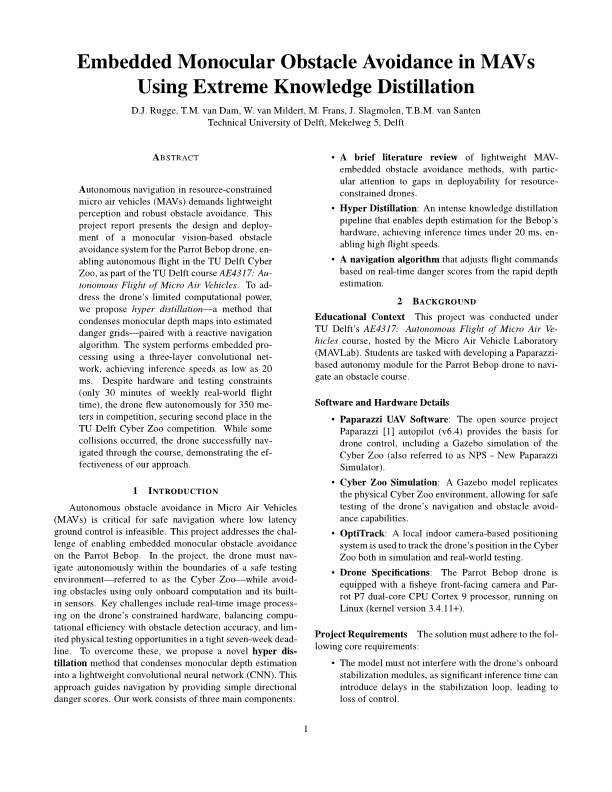

# Embedded Monocular Obstacle Avoidance in MAVs Using Extreme Knowledge Distillation

Welcome to the repository for the project 'Embedded Monocular Obstacle Avoidance in MAVs Using Extreme Knowledge Distillation' by D.J. Rugge, T.M. van Dam, M. Frans, W. van Mildert, T.B.M. van Santen, and J. Slagmolen.

This repository is a fork of the Paparazzi UAV project, prepared for the MSc course 'AE4317 - Autonomous Flight of Micro Air Vehicles' at the TU Delft. For a general overview of Paparazzi and the course, please see the [course manual](https://tudelft.github.io/coursePaparazzi/).

Our project focused on developing a lightweight, monocular obstacle avoidance system. Our module showed great flying speeds, winning the distance competition by 100 meters compared to the runner-up, but also caused significant collisions. We ultimately achieved second place in the course competition and learned a great deal. Further testing is required to find the exact point of failure—whether it stems from the sensing, the steering, or both!

---

## Project Report

For a complete overview of the project background, methodology, results, and ideas for future work, please read our full report. It contains all the high-level, and some low-level, information necessary to understand our contribution.

**Click the cover page below to open the PDF.**

Alternatively, you can use a direct link: **[View Report (report.pdf)](report.pdf)**

---

## Code Overview

The repository may seem complex due to all the Paparazzi-related files necessary for flying the drone. To point you in the right direction, our primary contributions can be found in the following folders and files:

| Path                                                     | Description                                                                                             |
| -------------------------------------------------------- | ------------------------------------------------------------------------------------------------------- |
| `FrontCamDetector`                                       | Files related to the MiDaS-based hyper-distilled obstacle detection model described in the report.      |
| `BottomCamDetector`                                      | Files for a model that performs boundary detection in the Cyberzoo (see note below).                    |
| `SmallConvNetwork`                                       | Files for a model based on the bounding box approach discussed in the report.                           |
| `sw/airborne/modules/computervision/obstacle_detection`  | C and header files for the custom Paparazzi module for obstacle and boundary detection.                 |
| `sw/airborne/modules/computervision/obstacle_avoidance`  | C and header files for the custom Paparazzi module for obstacle avoidance using the detection module.   |
| `utils`                                                  | Two bash scripts to convert and benchmark ONNX models for the drone.                                    |
| `conf/airframes/tudelft/bebop_obstacle_avoid`            | An airframe file heavily based on the one provided by the course.                                       |

### A Note on `BottomCamDetector`

The report does not contain a discussion on the code in the `BottomCamDetector` folder, as we were unable to integrate it effectively with the avoidance code. It is a simple binary classifier trained to determine whether the drone is inside or outside the Cyberzoo boundary using images from the bottom camera. While the model is very fast (approx. 3 ms inference time), steering with this limited information proved difficult. As a direction for future work, the model could be made more complex to provide a more informative output, such as identifying which region is safe to fly towards.
